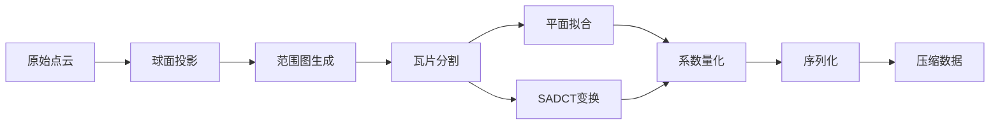

# RCPCC-P: 基于范围图的点云压缩系统 (Python版)

[](https://www.python.org/)
[](LICENSE)
[](http://www.open3d.org/)

## 📖 项目简介

RCPCC-P 是一个高效的点云压缩与解压缩系统，专为处理 LiDAR 点云数据设计。该项目采用基于范围图（Range Image）的投影方法，结合 DCT 变换和平面拟合技术，实现了高压缩比的点云数据压缩。

### 主要特点

- 🚀 **高压缩比**: 支持5个压缩等级
- 🎯 **保持精度**: 平衡压缩率与点云质量的关系
- 🔧 **灵活配置**: 支持自定义精度、瓦片大小等参数
- 📊 **可视化**: 内置点云对比可视化功能
- 🔄 **多格式支持**: 支持 .bin、.ply、.xyz 等常见点云格式
- ⚡ **优化算法**: 集成 SADCT 变换和 Zigzag 扫描优化

## 🎯 压缩等级说明

项目提供5个预定义的压缩等级，数值越大压缩比越大：

| 等级 | 描述 | 数据保留率 | 噪声水平 | 适用场景 |
|------|------|-----------|---------|---------|
| 1 | 高质量 | ~90% | 0.002 | 高精度建模、测量 |
| 2 | 平衡质量 | ~70% | 0.005 | 通用场景 |
| 3 | 标准压缩 | ~50% | 0.01 | 存储优化 |
| 4 | 高压缩 | ~30% | 0.02 | 网络传输 |
| 5 | 极限压缩 | ~10% | 0.05 | 快速预览 |

## 🛠️ 系统要求

### 基础环境

- Python 3.8 或更高版本
- 操作系统：Linux / macOS / Windows

### 核心依赖

```
numpy >= 1.21.0          # 数值计算
opencv-python >= 4.5.0   # 图像处理
open3d >= 0.15.0         # 3D数据处理与可视化
scipy >= 1.7.0           # 科学计算（FFT）
matplotlib >= 3.4.0      # 数据可视化
```

### 可选依赖

```
pyzstd >= 0.15.0         # Zstandard 压缩
grpcio >= 1.40.0         # 远程处理支持
```

## 📦 安装

### 1. 克隆仓库

```bash
git clone https://github.com/Courage-maker/RCPCC-P.git
cd RCPCC-P
```

### 2. 创建虚拟环境（推荐）

```bash
python -m venv venv
source venv/bin/activate  # Linux/macOS
# 或
venv\Scripts\activate     # Windows
```

### 3. 安装依赖

```bash
pip install -r requirements.txt
```

### 4. 验证安装

```bash
python example.py --list-levels
```

## 🚀 快速开始

### 基本用法

```bash
python example.py <输入文件> <压缩等级>
```

### 示例

```bash
# 使用等级3压缩点云
python example.py test_file/0000000000.bin 3

# 使用等级1（高质量）压缩
python example.py test_file/0000000000.bin 1 

# 禁用可视化
python example.py test_file/0000000000.bin 2 --no-visualization
```

### 命令行参数

```
位置参数:
  input_file            输入点云文件路径 (.bin, .ply, .xyz)
  compression_level     压缩等级 (1-5)，数值越大压缩比越大

可选参数:
  --no-visualization    禁用可视化
  --visualization-method {open3d,matplotlib,combined}
                        选择可视化方法（默认: open3d）
  --point-size SIZE     点的显示大小（默认: 2.0）
  --use-livox          使用 Livox LiDAR 参数
  --list-levels        显示压缩等级说明并退出
```

## 📂 项目结构

```
RCPCC-P/
├── example.py              # 示例程序和主入口
├── project_setup.py       # 项目配置和构建脚本
├── requirements.txt       # Python依赖列表
├── README.md             # 项目文档
│
├── data/                 # 数据目录
│   ├── input/           # 输入点云文件
│   └── output/          # 输出结果文件
│
├── modules/             # 核心压缩模块
│   ├── encoder_module.py    # 编码器模块
│   ├── decoder_module.py    # 解码器模块
│   ├── dct.py              # DCT变换实现
│   ├── binary_compressor.py # 二进制压缩
│   └── serializer.py       # 数据序列化
│
├── utils/               # 工具函数
│   ├── config.py           # 配置参数
│   ├── encoder.py          # 编码工具
│   ├── decoder.py          # 解码工具
│   ├── io.py              # 输入输出处理
│   ├── struct.py          # 数据结构定义
│   ├── pcc_module.py      # 点云压缩核心算法
│   └── utils.py           # 通用工具函数
│
└── test_file/           # 测试文件
```

## 🔬 工作原理

### 压缩流程



### 核心技术

1. **球面投影**: 将3D点云投影到2D范围图（Range Image）
2. **平面拟合**: 对局部平滑区域使用平面模型压缩
3. **SADCT变换**: 稀疏自适应离散余弦变换处理非平面区域
4. **Zigzag扫描**: 优化DCT系数的存储顺序
5. **量化编码**: 多级量化策略平衡质量与压缩比

## 📊 可视化功能

项目提供三种可视化方法：

### 1. Open3D 同时显示（推荐）
```bash
python example.py input.bin 3 --visualization-method open3d
```
- 同时打开两个窗口分别显示原始和重建点云
- 支持交互式3D查看
- 红色=原始点云，绿色=重建点云

### 2. Matplotlib 显示
```bash
python example.py input.bin 3 --visualization-method matplotlib
```
- 适用于没有Open3D的环境
- 3D散点图显示

### 3. 组合对比视图
```bash
python example.py input.bin 3 --visualization-method combined
```
- 在同一窗口中并排显示
- 便于直接对比

## ⚙️ 配置说明

### LiDAR 参数配置

在 `utils/config.py` 中配置 LiDAR 参数：

```python
# 标准 LiDAR
VERTICAL_DEGREE = 37.0      # 垂直视角
HORIZONTAL_DEGREE = 360.0   # 水平视角
ROW_OFFSET = 32.0
COL_OFFSET = 180.0

# Livox LiDAR（需要启用 USE_LIVOX）
USE_LIVOX = False
LIVOX_VERTICAL_DEGREE = 77.0
LIVOX_HORIZONTAL_DEGREE = 72.0
```

### 算法开关

```python
USE_SADCT = True      # 使用 SADCT 变换
USE_ZIGZAG = True     # 使用 Zigzag 扫描
VERBOSE = True        # 详细输出模式
FITTING = True        # 启用平面拟合
```

## 🔧 高级用法

### Python API 使用

```python
from modules.encoder_module import EncoderModule
from modules.decoder_module import DecoderModule
from utils.utils import load_pcloud, output_cloud

# 加载点云
pcloud = load_pcloud("input.bin")

# 压缩
encoder = EncoderModule(tile_size=8, compression_level=3)
compressed_data = encoder.encode_to_data(pcloud)

# 解压
decoder = DecoderModule(
    data=compressed_data,
    tile_size=8,
    use_compress=False
)
restored_pcloud = decoder.restored_pcloud

# 保存结果
output_cloud(restored_pcloud, "output.ply")
```

### 自定义参数

```python
# 使用自定义精度参数
encoder = EncoderModule(
    pitch_precision=0.15,    # 俯仰角精度
    yaw_precision=0.15,      # 偏航角精度
    threshold=0.05,          # 平面拟合阈值
    tile_size=16             # 瓦片大小
)
```

## 📈 性能指标

典型性能数据（基于KITTI数据集）：

| 压缩等级 | 压缩比 | 处理时间 | PSNR | 点保留率 |
|---------|-------|---------|------|---------|
| 1 | 2:1 | ~0.5s | >40dB | 90% |
| 2 | 3:1 | ~0.4s | >35dB | 70% |
| 3 | 5:1 | ~0.3s | >30dB | 50% |
| 4 | 8:1 | ~0.2s | >25dB | 30% |
| 5 | 10:1 | ~0.1s | >20dB | 10% |

*注：实际性能取决于点云复杂度和硬件配置*

## 🧪 测试

```bash
# 运行基本测试
python example.py test_file/0000000000.bin 3

# 测试所有压缩等级
for level in {1..5}; do
    python example.py test_file/0000000000.bin $level --no-visualization
done
```

## 🤝 贡献指南

欢迎贡献！请遵循以下步骤：

1. Fork 本仓库
2. 创建特性分支 (`git checkout -b feature/AmazingFeature`)
3. 提交更改 (`git commit -m 'Add some AmazingFeature'`)
4. 推送到分支 (`git push origin feature/AmazingFeature`)
5. 开启 Pull Request

## 📝 开发计划

- [ ] GPU 加速支持（CUDA）
- [ ] 实时压缩流式处理
- [ ] 更多点云格式支持（PCD、LAS）
- [ ] Web 界面
- [ ] 批量处理工具
- [ ] 性能分析工具

## ❓ 常见问题

### Q: 为什么可视化窗口无法显示？
A: 请确保已安装 Open3D 或 Matplotlib。在远程服务器上可能需要X11转发或使用 `--no-visualization` 参数。

### Q: 如何选择合适的压缩等级？
A: 
- 等级1-2：需要保持高精度的应用（建模、测量）
- 等级3：通用场景的平衡选择
- 等级4-5：网络传输或存储空间受限时

### Q: 支持哪些 LiDAR 类型？
A: 默认支持标准机械式 LiDAR，也可通过 `--use-livox` 参数支持 Livox 固态 LiDAR。

### Q: 如何处理大型点云文件？
A: 项目会自动处理，但建议：
- 使用较高的压缩等级
- 增加系统内存
- 分块处理超大文件

## 🙏 致谢

- (https://github.com/HITSZ-NRSL/RCPCC)
- Open3D 团队提供的优秀 3D 数据处理库
- KITTI 数据集用于测试
- 所有贡献者的支持

## 📚 相关论文

如果本项目对您的研究有帮助，请考虑引用：

```bibtex
@article{cao2025realtime,
  title={Real-Time LiDAR Point Cloud Compression and Transmission for Resource-Constrained Robots},
  author={Cao, Yuhao and Wang, Yu and Chen, Haoyao},
  journal={arXiv preprint arXiv:2502.06123},
  year={2025}
}
```
---

⭐ 如果这个项目对您有帮助，请给个星标！
